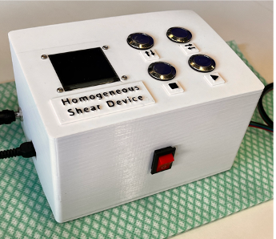

# ControlBox_ShearDevice

Used for operation of a (uniform) shear device created in order to stress protein drug products and test their aggregtation behavior. The device involves a rotor driven by a stepper motor. Using push buttons, desired RPM values as well as the experimental time can be selected.

